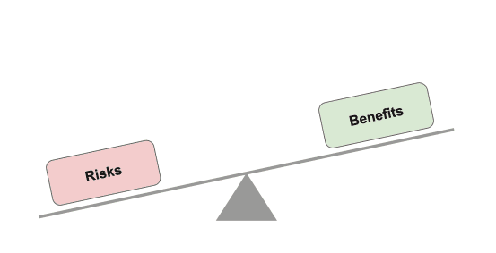

import CookieBanner from "../components/cookies"
import OutboundLink from "../components/outbound-link"

<CookieBanner />

Privacy is a fundamental right. Organisations have an obligation to protect privacy, and must consider important legal, ethical, and reputational concerns when working with personal or sensitive data. Our <OutboundLink href="https://www.gov.uk/government/publications/cdei-publishes-its-first-report-on-public-sector-data-sharing">report on public sector data sharing</OutboundLink> found that these concerns can lead to risk aversion that may inhibit data from being fully utilised to provide benefits for society. The use of PETs can help manage and mitigate some of the risks involved.

PETs can thus be an _enabler for innovation_, unlocking new opportunities for valuable data sharing and processing. Additionally, PETs can enable existing data sharing and processing to be carried out in a more privacy-focused way.

A data project with the potential to create significant benefits may be hindered or blocked completely if the associated risks are too high. This could be legal risks associated with compliance with data protection regulation, or commercial/reputational risks associated with handling sensitive customer information. When applied appropriately, PETs can provide strong guarantees on the level of privacy or security of the data they protect, and thus can greatly reduce the risk of sensitive data being disclosed. This can help tip the scales in favour of sharing or processing data, enabling innovation that may otherwise have remained untapped.

However, PETs are not a silver bullet. No single PET will fully address the privacy challenges inherent in a data-driven system, and PETs should be applied as part of a broader privacy ecosystem that includes appropriate access control systems, audit trails, and information governance structures.

Our research has found that increasing awareness and understanding of PETs and their use cases could foster greater adoption of the technologies. The [PETs adoption guide](/adoption-guide) aims to help in this regard, posing questions to help technologists working on data initiatives involving sensitive information to consider which PETs could be useful. The guide aims not to be overly prescriptive, but provides pointers to relevant resources and [use cases from the repository](/repository) that may support decision-making around utilising PETs.
